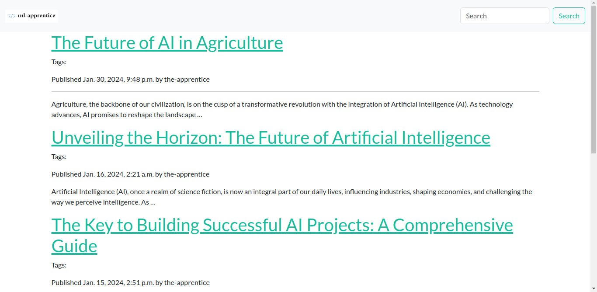
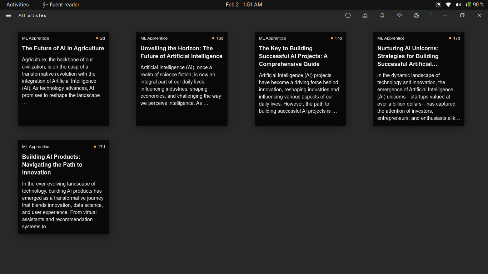

# ML Apprentice Blog

ML Apprentice is a Django-based blog project focused on Machine Learning and Artificial Intelligence topics. It allows you to publish articles, categorize them, and engage with readers through comments.


*Dashboard*

&nbsp;


*RSS Feed*

## Features

- **Blog Posts:** Share your knowledge and insights on ML and AI through blog posts.
- **Categories and Tags:** Organize your content with categories and tags.
- **Search Functionality:** Enable users to search for specific topics.
- **Comments:** Foster discussions with readers through comments on your posts.

## Installation

1. Clone the repository:

    ```bash
    git clone https://github.com/ladiyusuph/ml-apprentice.git
    ```

2. Navigate to the project directory:

    ```bash
    cd ml-apprentice
    ```

3. Install dependencies:

    ```bash
    pip install -r requirements.txt
    ```

4. Apply migrations:

    ```bash
    python manage.py migrate
    ```

5. Create a superuser account:

    ```bash
    python manage.py createsuperuser
    ```

6. Run the development server:

    ```bash
    python manage.py runserver
    ```

7. Access the admin panel at `http://127.0.0.1:8000/admin/` to create blog posts and manage content.

## Usage

- Create blog posts through the Django admin panel.
- Customize templates and styles as needed for your blog.
- Engage with the Django templating system to add more features.

## Contributing

If you'd like to contribute to the project, please follow these steps:

1. Fork the repository.
2. Create a new branch: `git checkout -b feature/new-feature`.
3. Commit your changes: `git commit -am 'Add new feature'`.
4. Push to the branch: `git push origin feature/new-feature`.
5. Submit a pull request.

## License

This project is licensed under the MIT License - see the [LICENSE.md](LICENSE.md) file for details.

## Acknowledgments

- Thanks to the Django community for providing a robust web framework.

Feel free to customize and expand upon this template to better suit your project's specifics.
